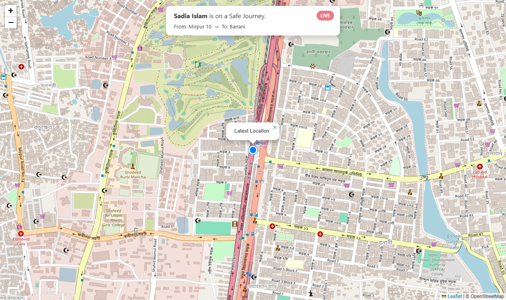
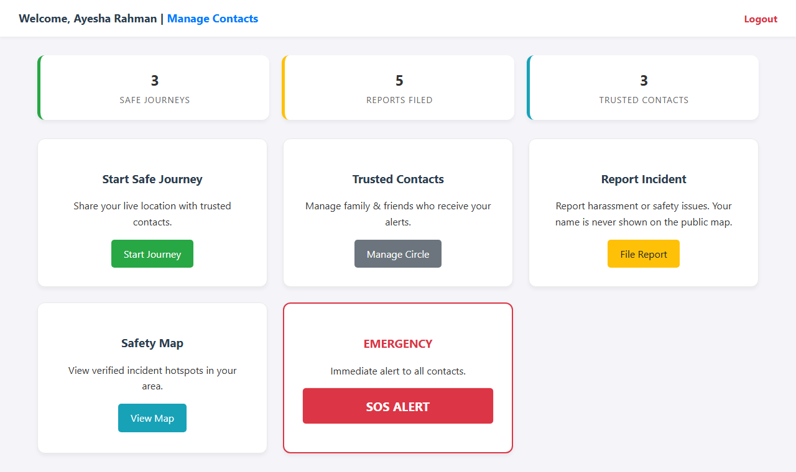
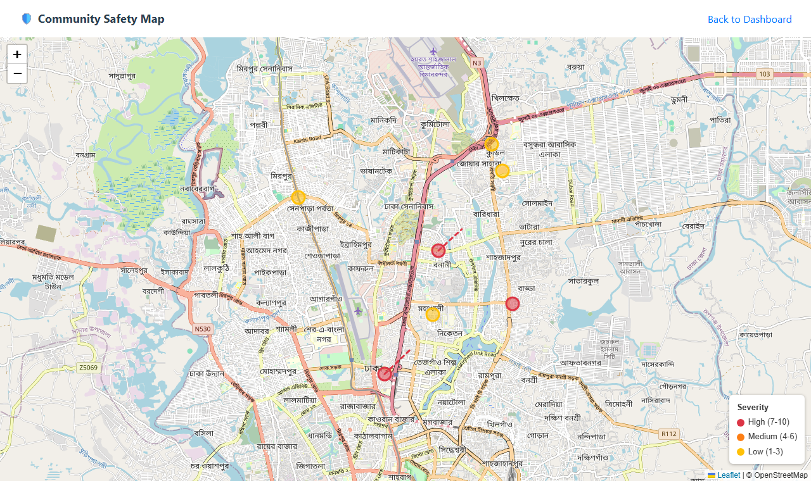
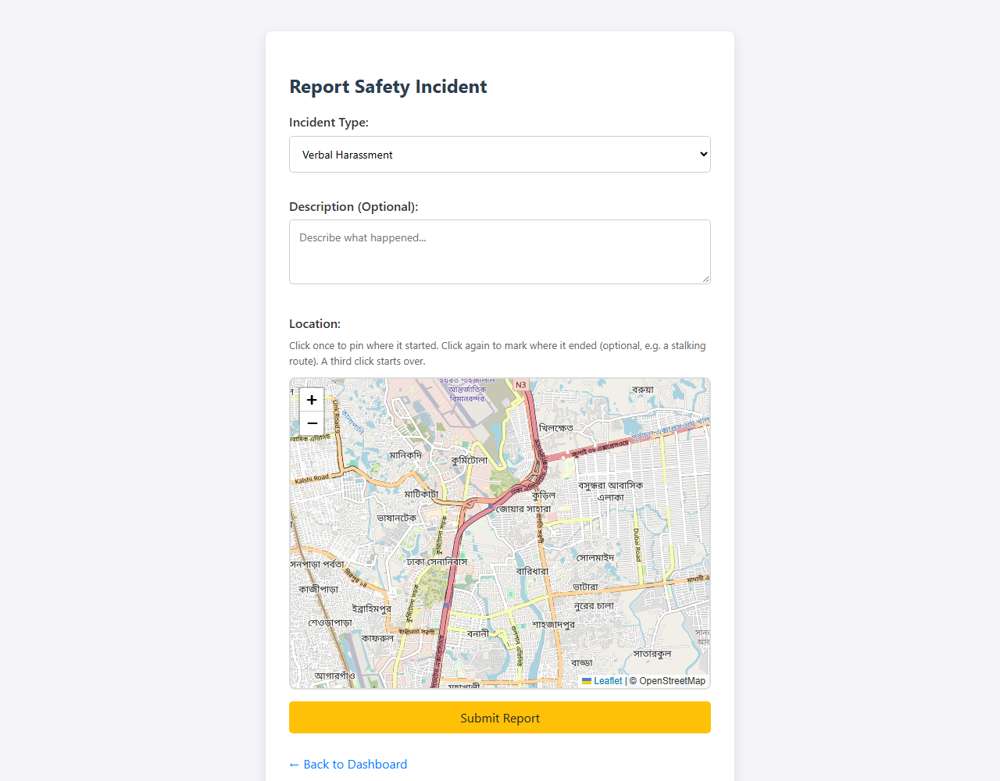
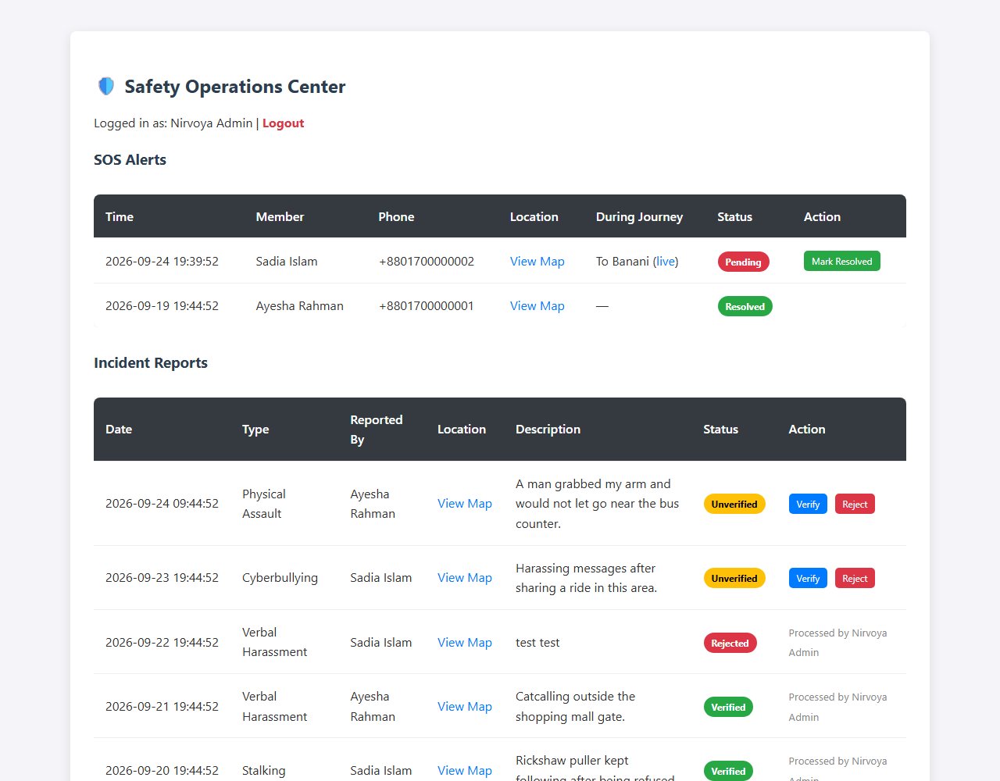
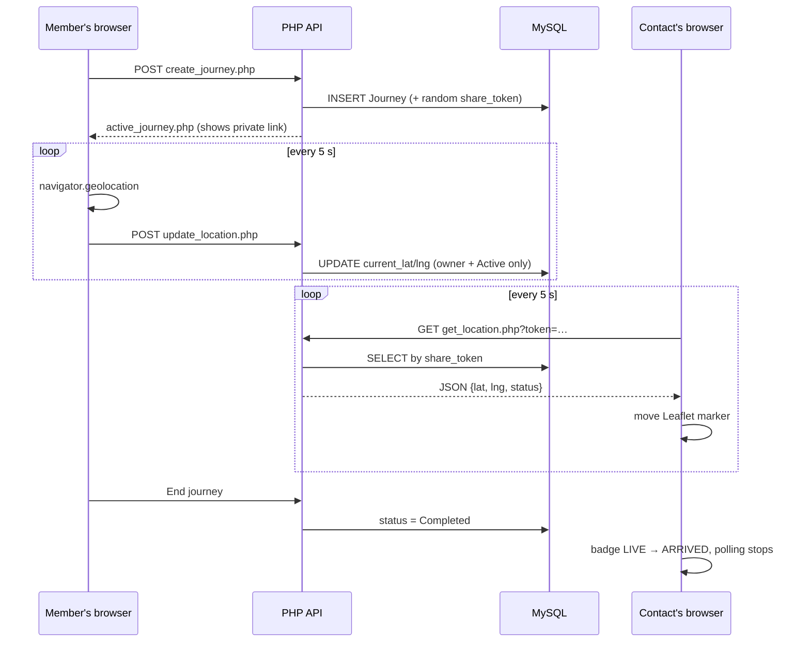
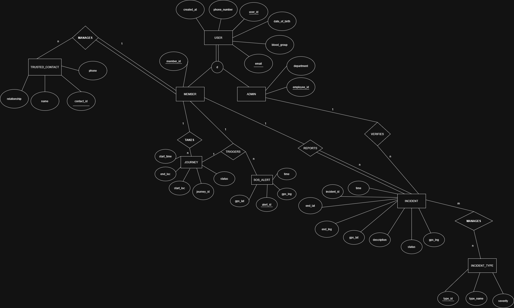

# Nirvoya: Women's Safety & Community Platform

**Nirvoya** (নির্ভয়া, *"fearless"* in Bengali) is a web platform for women's safety. Members can share their live location on a journey, send an SOS alert to trusted contacts with one tap, and report harassment on a map. Admin-verified reports build a community safety map of danger zones.




## Why

Public harassment often goes unreported, and people traveling alone have few simple ways to let someone know where they are. Nirvoya does three things:

| | |
|---|---|
| **Prevention** | *Safe Journey*: share a live-updating location link with family and friends while traveling. |
| **Reaction** | *SOS*: one button logs your GPS position and alerts your whole trusted circle. |
| **Advocacy** | *Community map*: crowd-sourced, admin-verified incident reports show where the danger zones are. |

The maps use **Leaflet.js + OpenStreetMap**, so the project needs no paid API key (for example, Google Maps).

## Features

**For members**
- 🔐 Registration and login with hashed passwords and role-based routing (Member / Admin)
- 🧭 **Live Safe Journey tracking**: the browser sends a GPS position every 5 s. Contacts open a private link and watch a marker move on the map with no page reloads.
- 🚨 **SOS alert**: stores the location, automatically links the alert to the active journey if there is one, and notifies all trusted contacts (simulated)
- 👥 **Trusted circle**: add and remove the family and friends who receive alerts
- 📍 **Incident reporting**: pin a location on the map, or click twice to mark a route (for example, being followed from A to B), and pick a category
- 🗺️ **Community safety map**: verified incidents color-coded by severity. Reporter identities are never shown.
- 📊 **Personal dashboard**: completed journeys, reports filed, and circle size, all from SQL aggregates

**For trusted contacts**
- No account needed. They get an unguessable tracking link that shows **LIVE** until the member marks **ARRIVED**.

**For admins (Safety Operations Center)**
- Review incident reports and **verify** or **reject** them. Only verified reports reach the public map.
- Monitor **SOS alerts**, jump to live tracking when an alert happened during a journey, and mark alerts resolved.

## Screenshots

| Member dashboard | Community safety map |
|---|---|
|  |  |
| **Report an incident** | **Admin: Safety Operations Center** |
|  |  |

## How Live Tracking Works



The app updates one row per journey instead of inserting a new row every 5 seconds, so the database does not grow during a trip.

## Database Design

The database was designed from an EER model and normalized to **3NF**. It includes a disjoint **specialization** (User → Member | Admin), a **ternary** relationship (Member + Journey → SOS Alert), and an **M:N** relationship resolved through a junction table (Incident ↔ Incident Type).



📄 Full write-up with the relational schema, mapping decisions, normalization, and key queries: **[docs/DATABASE.md](docs/DATABASE.md)**

## Getting Started

### Prerequisites
- [XAMPP](https://www.apachefriends.org/) (Apache + PHP 8 + MariaDB), or any PHP 8 + MySQL/MariaDB setup
- A modern browser with location access allowed

### 1. Get the code
Clone or copy this folder into XAMPP's web root:
```
C:\xampp\htdocs\nirvoya-women-safety-platform
```

### 2. Create the database
Start **Apache** and **MySQL** in the XAMPP Control Panel, open <http://localhost/phpmyadmin>, and import these files in order (**Import** tab):

1. `database/schema.sql`: creates `nirvoya_db`, all tables, and incident categories
2. `database/demo_data.sql` *(optional)*: demo accounts, contacts, journeys, SOS alerts, and reports around Dhaka

Or from a terminal:
```bash
mysql -u root < database/schema.sql
mysql -u root < database/demo_data.sql
```

### 3. Open the app
<http://localhost/nirvoya-women-safety-platform/>

### Demo accounts
All demo accounts use the password `demo1234`.

| Role | Email |
|---|---|
| Admin | `admin@nirvoya.test` |
| Member | `member@nirvoya.test` |
| Member (has a journey in progress) | `sadia@nirvoya.test` |

### Configuration
Database settings default to a stock XAMPP install (`root`, no password). To change them, edit [`api/db_connect.php`](api/db_connect.php) or set the environment variables `DB_HOST`, `DB_PORT`, `DB_USER`, `DB_PASS`, and `DB_NAME`.

> **Note:** Browsers only allow geolocation on `localhost` or over **HTTPS**. Testing live tracking from a phone on your LAN needs HTTPS.

## Project Structure

```
├── index.html              # Login
├── register.html           # Sign up
├── dashboard.php           # Member home: stats + feature cards + SOS
├── start_journey.php       # Enter start/destination, grab initial GPS
├── active_journey.php      # Sharer view: sends GPS every 5 s, shows share link
├── track_journey.php       # Public contact view (token-protected), live map
├── contacts.php            # Trusted circle management
├── report_incident.php     # Map-based incident reporting
├── community_map.php       # Verified incidents, color-coded by severity
├── admin_panel.php         # SOS monitoring + report verification
├── api/                    # Form handlers and JSON endpoints
│   ├── db_connect.php
│   ├── login.php · register.php · logout.php
│   ├── create_journey.php · update_location.php · end_journey.php · get_location.php
│   ├── trigger_sos.php · manage_contacts.php
│   └── report_incident.php · get_verified_incidents.php
├── css/style.css
├── database/
│   ├── schema.sql
│   └── demo_data.sql
└── docs/
    ├── DATABASE.md
    ├── diagrams/           # EER + schema (PNG and editable .drawio)
    └── screenshots/
```

## Security

- Passwords are stored with `password_hash()` (bcrypt). The session ID is regenerated at login.
- Every query uses **PDO prepared statements**.
- Tracking links use a **random 128-bit token**, not the sequential journey ID.
- **Ownership checks** on journey updates, journey endings, and contact deletion. A user cannot modify another user's data.
- All user-supplied text is **escaped on output**. Map popups are built from text nodes, not HTML strings.
- Actions that change data (verify/reject, resolve SOS, delete contact) only accept **POST**.

## Limitations & Future Work

- **SOS notifications are simulated.** The app logs the alert and counts the contacts. Real delivery would need an SMS/email API such as Twilio.
- Live updates use **polling** every 5 s. WebSockets or Server-Sent Events would cut latency and server load.
- CSRF tokens, rate limiting, and email verification are not implemented yet.
- Ideas: overdue-journey alerts based on an ETA, proximity clustering and heatmaps on the community map, filtering the map by category, and a mobile app with background location.

## Team

This started as a two-person term project for an undergraduate **Database Systems** course (Fall 2025). It was later revisited to fix a schema bug that broke incident reporting, close privacy and XSS gaps, add the SOS monitoring panel, and write the documentation above.

| Member | Contributions |
|---|---|
| **Sandip Kumar Paul** ([@sandipkumarpaul](https://github.com/sandipkumarpaul)) | Schema normalization, live GPS tracking, SOS alert logic, incident reporting with map pinning, admin verification panel, Leaflet/OpenStreetMap integrations |
| **Tanjila Afsari Rubina** ([@tanjilaafsarirubina](https://github.com/tanjilaafsarirubina)) | EER design, authentication and user hierarchy, trusted contacts management, dashboard and core UI design |
