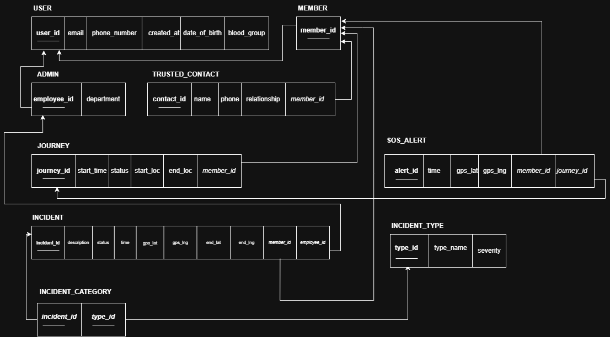

# Database Design

Nirvoya's data layer is a MySQL/MariaDB schema designed top-down: **EER diagram → relational schema → normalization check → SQL**. The full script is in [`database/schema.sql`](../database/schema.sql).

## EER Diagram


## Relational Schema



Editable sources: [`eer-diagram.drawio`](diagrams/eer-diagram.drawio), [`schema-diagram.drawio`](diagrams/schema-diagram.drawio). Open them at [app.diagrams.net](https://app.diagrams.net).

## Tables

| Table | Purpose | Key relationships |
|---|---|---|
| `Users` | Shared attributes for every account (email, password hash, phone, DOB, blood group) | Superclass |
| `Members` | Women using the app for their own safety | `member_id` → `Users.user_id` |
| `Admins` | Moderators who verify reports | `employee_id` → `Users.user_id` |
| `Trusted_Contacts` | Family/friends in a member's safety circle | N contacts : 1 member |
| `Journeys` | A "Safe Journey" with live `current_lat` / `current_lng` | N journeys : 1 member |
| `SOS_Alerts` | Panic-button events with GPS position | Member + (optional) Journey |
| `Incidents` | Crowd-sourced harassment reports, optional start → end route | Reported by a member, verified by an admin |
| `Incident_Types` | Lookup of categories and their severity (1–10) | — |
| `Incident_Categories` | Junction table tagging incidents with types | M incidents : N types |

## How the EER Constructs Were Mapped

**Disjoint specialization (User → Member | Admin).** Each subclass gets its own table whose primary key is also a foreign key to `Users`. A user is either a member or an admin. Registration inserts into `Users` and `Members` inside one transaction, so a failure in either insert rolls back both.

**Ternary relationship (Member, Journey → SOS Alert).** `SOS_Alerts` carries foreign keys to both `Members` and `Journeys`. `journey_id` is nullable: an SOS pressed during an active journey is linked to it automatically, and a standalone panic press is not.

**M:N relationship (Incident ↔ Incident Type).** This is resolved with the `Incident_Categories` junction table and its composite primary key `(incident_id, type_id)`.

**Two roles on one entity (Incident).** `member_id` records who reported it (`ON DELETE SET NULL`, so reports survive account deletion), and `employee_id` records which admin verified or rejected it (NULL until reviewed).

## Normalization

**1NF.** All attributes are atomic. No column holds a list (for example, comma-separated phone numbers). Multi-valued data such as a member's contacts lives in its own table. Coordinates are stored as separate `lat` / `lng` decimal columns.

**2NF.** Every main entity uses a single-column surrogate key (`user_id`, `journey_id`, ...), so partial dependencies cannot occur. The only composite key is in `Incident_Categories`, where both columns together *are* the fact being stored.

**3NF.** There are no transitive dependencies. For example, an incident's severity depends on its *type*, not on the incident itself, so `severity` lives in `Incident_Types` and is reached through `type_id`. Storing it on `Incidents` would create the dependency `incident_id → type → severity`.

## Notable Queries

Admin review screen, joining 4 tables (plus a self-join on `Users` for the reviewing admin's name):

```sql
SELECT i.*, u.full_name, t.type_name, a.full_name AS admin_name
FROM Incidents i
LEFT JOIN Users u ON i.member_id = u.user_id
JOIN Incident_Categories ic ON i.incident_id = ic.incident_id
JOIN Incident_Types t ON ic.type_id = t.type_id
LEFT JOIN Users a ON i.employee_id = a.user_id
ORDER BY i.incident_time DESC;
```

Live tracking uses a single `UPDATE` per GPS ping instead of inserting a new row every 5 seconds, so the table does not grow during a trip:

```sql
UPDATE Journeys SET current_lat = :lat, current_lng = :lng
WHERE journey_id = :jid AND member_id = :uid AND status = 'Active';
```

## Implementation Additions

These columns were added beyond the original diagrams:

- `Incidents.end_lat`, `Incidents.end_lng`: optional end point, so a report can describe a route (for example, being followed from A to B).
- `Journeys.share_token`: a random 128-bit token used in the public tracking link. Without it, sequential journey IDs would let anyone watch anyone's live location by guessing URLs.
